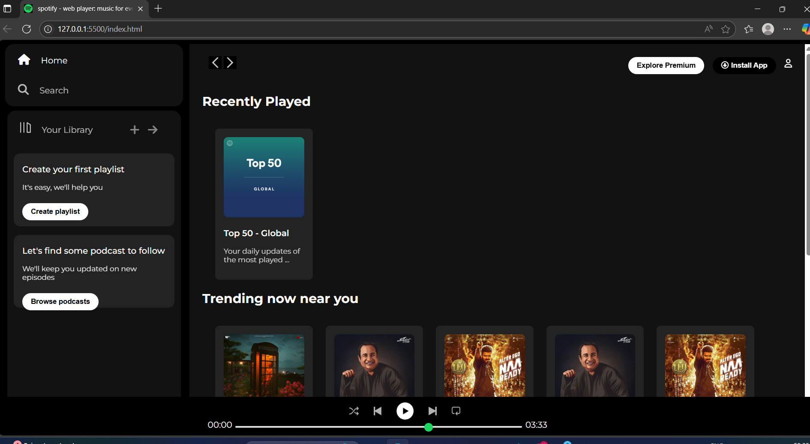

# 🎶 Spotify Web Player Clone

A simple clone of Spotify's web player built using **HTML & CSS** only.  
This project focuses on layout design, styling, and responsive UI.

---

## 🚀 Features
- Sidebar with navigation (Home, Search, Your Library)
- Sticky navigation bar with actions (Explore Premium, Install App, User)
- Sections for:
  - Recently Played
  - Trending Now Near You
  - Featured Charts
- Music player controls at the bottom
- Responsive design

---

## 📸 Screenshots

### Home Page


---

## 📂 Project Structure

```
spotify-clone/
│── index.html # Main HTML file
│── style.css # Stylesheet
│── img/ # All icons and images
│── preview.png   # Screenshot of project

```


---

## 🛠️ Tech Stack
- **HTML5**
- **CSS3**
- **FontAwesome** (for icons)
- **Google Fonts** (Montserrat)

---

## 📦 How to Run
1. Clone the repository:
   ```bash
   git clone https://github.com/your-username/spotify-clone.git
2. Open index.html in your browser.
